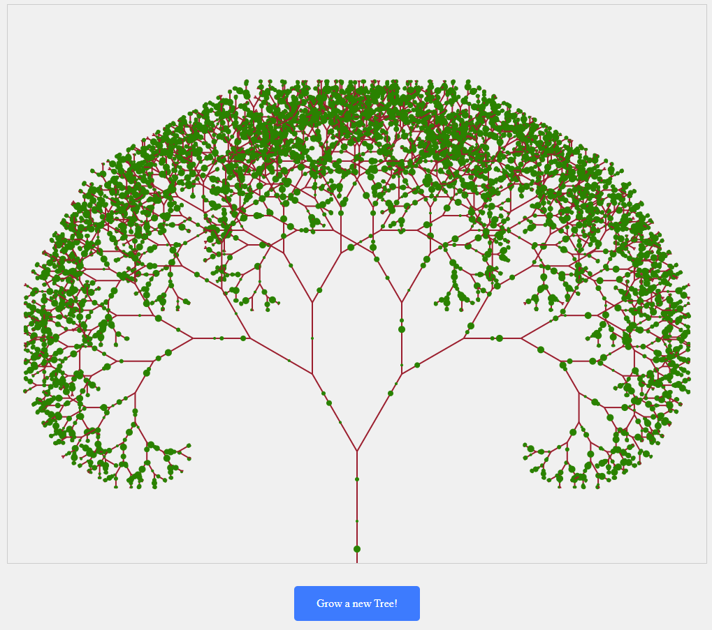
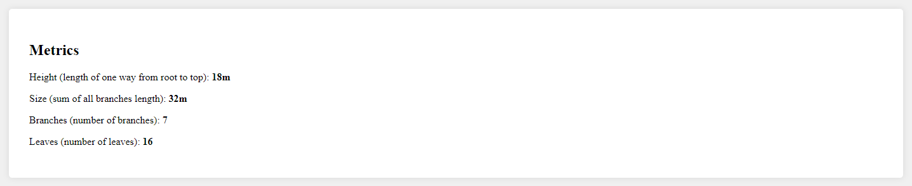
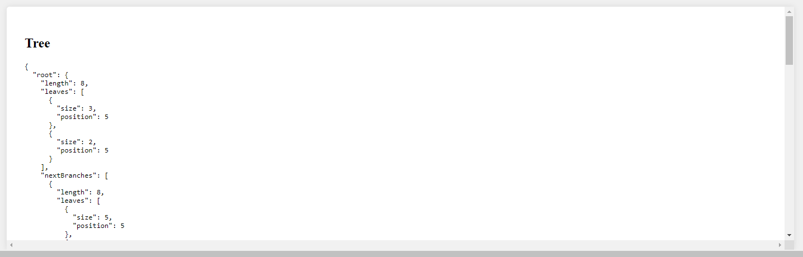

# 🌱 Legavote Tree 🌳

Cette application a été réalisée dans le cadre du test technique pour Legavote.

## 📋 Enoncé

Les branches d’un arbre grandissent toutes les secondes de 1 cm. Arrivée à une longueur de 8 cm, une branche se scinde en deux nouvelles branches.
Des feuilles poussent aléatoirement sur les branches et tombent après avoir grandi
Initialement l’arbre à une taille de 5 cm.

Écrire en PHP un script qui permet de visualiser l’évolution de l’arbre. L’affichage de la sortie est libre:

- PHP natif, ou Symfo
- HTML / CSS / JS ou affichage dans la console
- Affichage de metriques (taille de l’arbre, nombre de branches, nombre de feuille, etc)

## 💡 Conception

- Mise en place de 3 entités afin de modéliser l'arbre : Tree, Branch et Leaf.
- Approche récursive, l'arbre est initialisé avec une unique branche. Une fois la taille souhaitée atteinte, la branche créé 2 enfants et pointe vers eux. Ce process est ensuite répété pour chaque branche.
- Cycle de vie : Une fois l'arbre instancié, la fonction grow() est appelée sur la branche racine. Chaque branche a la responsabilité de gérer sa taille et ses feuilles. Elle doit ensuite propager la fonction grow() aux branches suivantes, le cas échéant.
- Il y a 3 routes : `tree_index`, `tree_grow` et `reset_session`.
  - `tree_index` est utile pour initialiser l'arbre. Elle render un template twig qui affiche l'arbre et ses données, et qui contient un script js chargé d'appeler toutes les secondes la route `tree_grow` et de mettre à jour le DOM.
  - `tree_grow` fonctionne comme un endpoint d'api. Elle est appelée toutes les secondes et fait grandir l'arbre d'un cycle. Elle retourne une réponse JSON.
  - `reset_session` est simplement en charge de reset la session pour générer un nouvel arbre.
- Valeurs de seuil choisies :
  - L'arbre est initialisé à une hauteur de 5 et est limité à une hauteur de 90 pour éviter des soucis de fluidité du navigateur.
  - Une branche se scinde une fois que sa longueur atteint 8. Après cela elle ne grandit plus mais continue de mettre à jour son feuillage.
  - Une feuille est considérée comme morte et disparait une fois qu'elle a atteint la taille de 5.

## 🚀 Fonctionnalités

- Génère de façon cyclique un arbre, à raison de 1 cycle par seconde.
- Mise à jour et affichage dynamique de l'arbre et de ses métriques.
- 3 visualisations : rendu svg, métriques calculées et rendu JSON.
- Métriques :
  - Hauteur (height), correspond à la longueur d'un unique chemin depuis la racine au sommet.
  - Taille (size), correpond à la somme de la longueur de toutes les branches de l'arbr.
  - Nombre de branches
  - Nombre de feuilles
- L'arbre est **sauvegardé** dans une session ce qui permet de refresh ou fermer la page sans perte, et de reprendre sa croissance à la réouverture de la page.
- Possibilité de clear la session pour planter un nouvel arbre.

## 🔨 Installation

_Note : Pour réaliser les étapes suivantes, assurez vous d'avoir PHP 8.2 ou supérieur, Composer, et Symfony CLI sur votre machine. En cas de problèmes, vous trouverez plus de détails sur la [documentation de Symfony](https://symfony.com/doc/current/setup.html#creating-symfony-applications)._

1. Cloner le repo sur votre machine locale.
2. Aller dans le dossier du projet et éxecuter `composer install`.
3. Démarrer le serveur Symfony avec `symfony server:start`.
4. Ouvrir un navigateur et aller à l'addresse [http://localhost:8000/](http://localhost:8000/) (le port peut être différent si cette adresse est déjà utilisée).
5. Pour arrêter le serveur, faire `Ctrl+C` puis `symfony server:stop`.

## 📸 Screenshots

